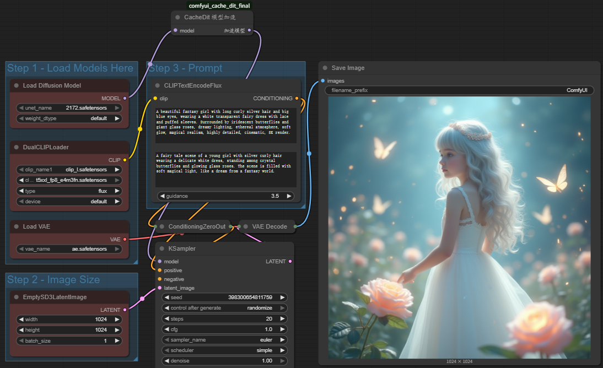

# ComfyUI CacheDit 插件

这是一个为 **ComfyUI** 提供扩散模型推理加速的小插件，目前实现了最基础的缓存思路，推理一步跳一步

⚠️ **注意：现在的代码只是一个最小复现版本，并不是完整的 CacheDit 实现**  
还缺少动态缓存、缓存替换策略等更多特性（见下方 TODO）。

---

## ✨ 特性

- **简单直接**：开箱即用，无需额外配置
- **加速明显**：在 FLUX 等模型上能获得接近 2x 的推理提速
- **即插即用**：和普通节点一样放到工作流中使用
- **调试方便**：带有基础的性能统计信息

---

## 📦 安装

1. 把插件文件夹放到 ComfyUI 的 `custom_nodes` 目录下  
2. 重启 ComfyUI 即可

---

## 🔧 使用方法

1. 在工作流中添加 **`CacheDit 模型加速`** 节点  
2. 把模型连接到该节点  
3. 使用加速后的模型进行推理  

示例：  

---

## 📊 工作原理（当前版本）

- 前几步正常运行（预热）
- 之后每隔一步跳过计算，直接复用之前的结果
- 在复用的结果上加入轻微噪声，避免图像出现明显伪影  

这种做法利用了扩散模型相邻步之间结果相似的特点，因此可以节省一半左右的计算。

---

## ⚡ 性能表现

- **FLUX 模型**：加速可达约 2x  
- **缓存命中率**：理论上约 50%  
- **质量影响**：肉眼几乎看不出差别  

---

## 🛠 故障排查

如果节点没有生效，可以尝试：  
1. 查看控制台输出的调试日志  
2. 确认模型类型是否兼容（目前主要支持 transformer 架构）  
3. 检查统计信息，确认缓存是否真的被使用  

---

## 🚧 TODO

- [ ] 实现CacheDit的特性不再是简单的推理一步跳过一步  

---

## 📄 License

开源项目，欢迎 issue 和 PR。
